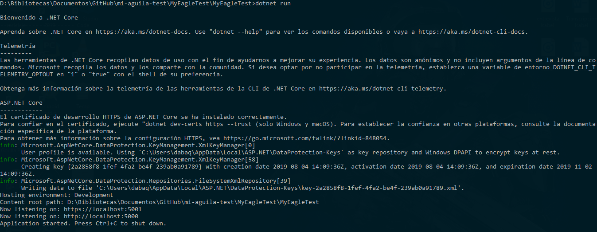
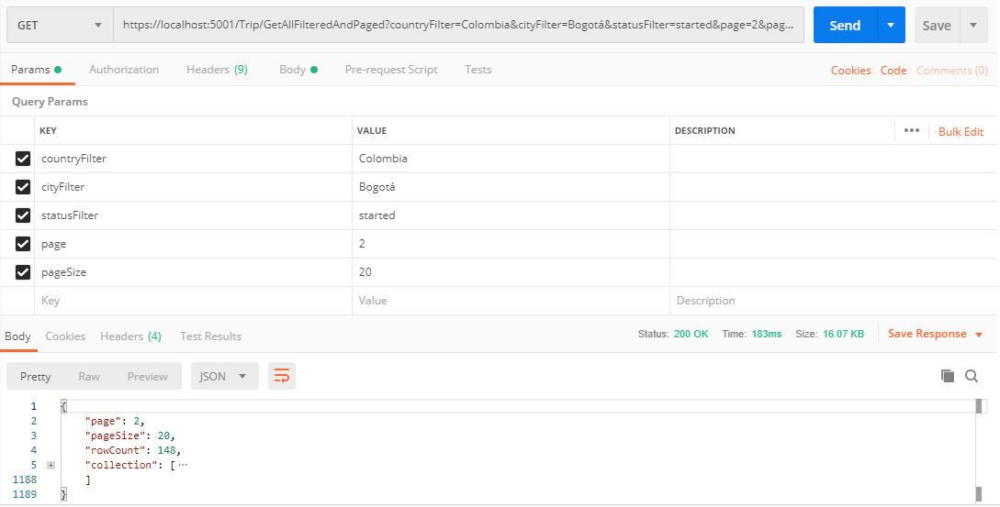
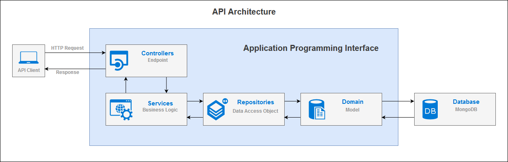

# Mi Aguila Test (Backend)
En este repositorio se describe la implementación de un API que cuenta con 9 *enpoints* principales, los cuales buscan resolver los siguientes requisitos:

- Consultar la cantidad de viajes totales
- Consultar la cantidad de viajes totales por ciudad
- Consultar la cantidad de viajes totales por país
- Crear un viaje
- Actualizar un viaje
- Consultar los viajes actuales (en estado *'started'*)

Inicialmente, es necesario mencionar que esta implementación fue desarrollada utilizando C#, con el uso de *.NET Core 2.2*, el cual fue desplegado en [https://myeagletest.azurewebsites.net/](https://myeagletest.azurewebsites.net/).

## *Endpoints*
Según los requisitos, se han implementado una serie de *endpoints* que permitan la solución de cada uno de estos.

1. Consultar la cantidad de viajes totales - https://myeagletest.azurewebsites.net/Trip/GetQuantityRecords [GET]
2. Consultar la cantidad de viajes totales por ciudad - https://myeagletest.azurewebsites.net/Trip/GetQuantityRecords?cityFilter=Bogotá [GET]
3. Consultar la cantidad de viajes totales por país - https://myeagletest.azurewebsites.net/Trip/GetQuantityRecords?countryFilter=Colombia [GET]
4. Crear un viaje - https://myeagletest.azurewebsites.net/Trip/Add [POST]
5. Actualizar un viaje - https://myeagletest.azurewebsites.net/Trip/Update [PUT]
6. Consultar los viajes actuales - https://myeagletest.azurewebsites.net/Trip/GetAllFilteredAndPaged?statusFilter=started [GET]

**NOTA 1:** Este último método recibe también como argumento filtros de país, ciudad, estado, el número de la página y la cantidad de registros por página, debido a que la información puede escalar y fue necesario realizar la paginación de los registros desde la implementación del API. Si este método no recibe argumentos, los valores por defecto de page y pageSize son 1 y 10, respectivamente.

Este es un ejemplo del *endpoint* con todos sus parámetros:
6.1. Consultar los viajes con filtros y paginación - https://myeagletest.azurewebsites.net/Trip/GetAllFilteredAndPaged?countryFilter=Colombia&cityFilter=Bogotá&statusFilter=started&page=2&pageSize=20 [GET]

**Extra**

Se realizaron algunos métodos extra que se consideraron necesarios, con el fin de que el API ofrezca una mejor funcionalidad.

7. Consultar todos los viajes - https://myeagletest.azurewebsites.net/Trip/GetAll [GET] (Aunque este método no tiene ningún tipo de paginación).
8. Consultar viaje por ID - https://myeagletest.azurewebsites.net/Trip/GetById?id=5d448f6f7744a13550ceabc3 [GET]
9. Crear muchos viajes - https://myeagletest.azurewebsites.net/Trip/AddAll [POST] (Método con el cual se hizo la migración inicial)
10. Eliminar viaje por ID - https://myeagletest.azurewebsites.net/Trip/DeleteById [DELETE]
11. Eliminar viaje - https://myeagletest.azurewebsites.net/Delete [DELETE]

**NOTA 2:** Los archivos JSON los podrá encontrar haciendo clic aquí. Adicionalmente, la documentación de esta API fue realizada usando Swagger y podrá ver el archivo correspondiente aquí

## Configuración de la base de datos
Esta API cuenta con una conexión a una base de datos no relacional en MongoDB. Por lo tanto, si usa Windows, MongoDB se instala en *C:\Archivos de programa\MongoDB* de forma predeterminada. Por lo tanto, deberá agregar *C:\Archivos de programa\MongoDB\Server\<versión>\bin* a la variables de entorno *Path* (Reemplace <versión> por la versión de Mongo que ha instalado en su computador). 

Posteriormente, deberá elegir una carpeta dentro de su computador, donde desea almacenar los datos. Luego, deberá abrir una consola y ejecutar el siguiente comando:

```
> mongod --dbpath <data_directory_path>
```
Recuerde reemplazar *<data_directory_path>* con la carpeta que seleccionó para almacenar la información.

Después, escriba el siguiente comando:

```
> mongo
```

Ahora procederemos a crear la base de datos con el siguiente comando

```
> use MyEagleTestDb
```

Si aún no existe, se crea una base de datos llamada MyEagleTestDb. Si la base de datos existe, su conexión se abre para transacciones.

Ahora, procedemos a crear la colección con el siguiente comando:

```
> db.createCollection('Trips')
```
Y se obtendrá el siguiente mensaje de: *{ "ok" : 1 }* como se muestra en la siguiente imagen:


> Resultado de la creación de la base de datos y la colección.

## Ejecución del API

En primer lugar, asegúrese de tener la versión de *.NET Core 2.2. SDK* el cual podrá descargar en el sigiente enlace [https://dotnet.microsoft.com/download](https://dotnet.microsoft.com/download), para el SO de su preferencia.

Se recomienda verificar que la versión sea igual o superior a la 2.2., con el siguiente comando:
```
> dotnet --version
```

Posteriormente, debe abrir una consola de comandos sobre la carpeta donde se encuentra la solución
```
> dotnet run
```
Este comando se encargará de instalar las dependencias, compilar y ejecutar la aplicación (por defecto, *http* en el puerto 5000 y *https* en el puerto 5001)



Finalmente, podremos realizar una prueba desde Postman, como se muestra en la siguiente imagen:




## Arquitectura del API

En la siguiente imagen se muestra la arquitectura general del API



Sin embargo, si desea conocer más información sobre el diseño e implementación de la aplicación, podrá descargar un documento haciendo clic aquí.

Elaborado por: *Diego Andrés Baquero*


