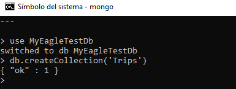

# Mi Aguila Test (Backend)
En este repositorio se describe la implementación de un API que cuenta con 9 *enpoints* principales, los cuales buscan resolver los siguientes requerimientos:

- Consultar la cantidad de viajes totales
- Consultar la cantidad de viajes totales por ciudad
- Consultar la cantidad de viajes totales por país
- Crear un viaje
- Actualizar un viaje
- Consultar los viajes actuales (en estado *'started'*)

Inicialmente, es necesario mencionar que esta implementación fue desarrollada utilizando C#, con el uso de *.NET Core 2.2*, el cual fue desplegado en [https://myeagletest.azurewebsites.net/](https://myeagletest.azurewebsites.net/).


## Configuración de la base de datos
Esta API cuenta con una conexión a una base de datos no relacional en MongoDB. Por lo tanto, si usa Windows, MongoDB se instala en *C:\Archivos de programa\MongoDB* de forma predeterminada. Por lo tanto, deberá agregar *C:\Archivos de programa\MongoDB\Server\<versión>\bin* a la variables de entorno *Path* (Reemplace <versión> por la versión de Mongo que ha instalado en su computador). 

Posteriormente, deberá elegir una carpeta dentro de su computador, donde desea almacenar los datos. Luego, deberá abrir una consola y ejecutar el siguiente comando:

```
> mongod --dbpath <data_directory_path>
```
Recuerde reemplazar *<data_directory_path>* con la carpeta que seleccionó para almacenar la información.

Después, escriba el siguiente comando:

```
> mongo
```

Ahora procederemos a crear la base de datos con el siguiente comando

```
> use MyEagleTestDb
```

Si aún no existe, se crea una base de datos llamada MyEagleTestDb. Si la base de datos existe, su conexión se abre para transacciones.

Ahora, procedemos a crear la colección con el siguiente comando:

```
> db.createCollection('Trips')
```
Y se obtendrá el siguiente mensaje de: *{ "ok" : 1 }* como se muestra en la siguiente imagen:


> Resultado de la creación de la base de datos y la colección.

